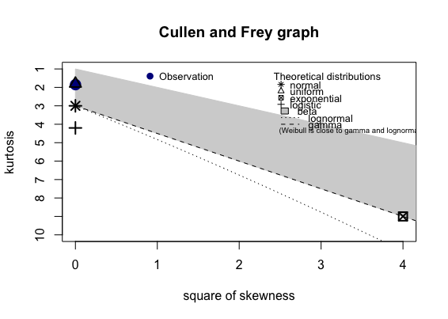
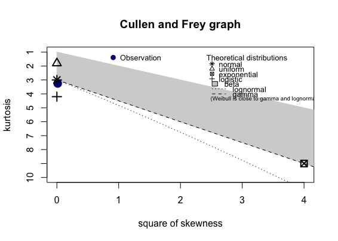
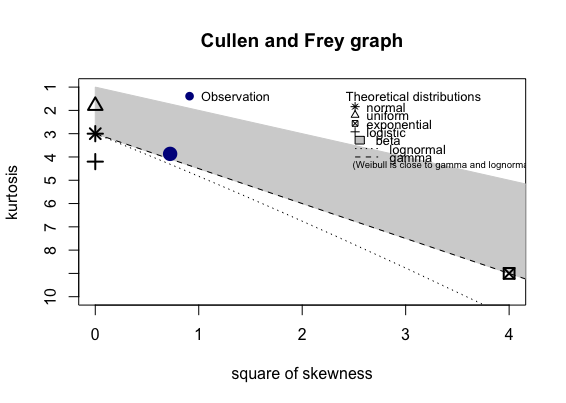
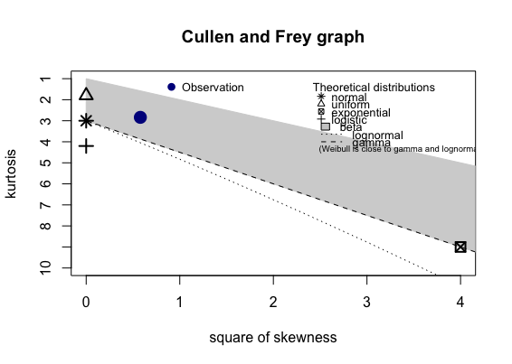
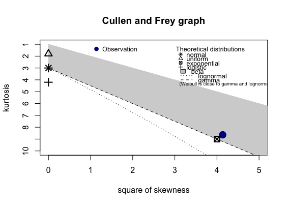
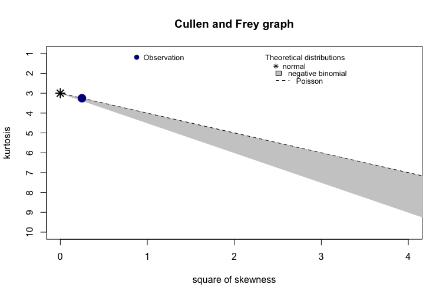

# Distribution Tests

Distribution fittings were performed with `fitdistrplus` package in R.

Data can be generated with `make random`.

## Uniform Dist.

`X ~ Uniform(3,7)`



```
summary statistics
------
min:  3.000019   max:  6.999995 
median:  4.999382 
mean:  5.000009 
estimated sd:  1.154875 
estimated skewness:  0.001044869 
estimated kurtosis:  1.798211 
```

## Normal Dist.

`X ~ Normal(4,0.3)`



```
summary statistics
------
min:  2.550521   max:  5.590307 
median:  4.000304 
mean:  4.000051 
estimated sd:  0.3003511 
estimated skewness:  -0.003930505 
estimated kurtosis:  3.001237 
```

## Gamma dist.

`X ~ Gamma(5,5)`



```
summary statistics
------
min:  0.02923115   max:  5.016571 
median:  0.9333718 
mean:  0.9993461 
estimated sd:  0.4470667 
estimated skewness:  0.8938456 
estimated kurtosis:  4.200029 
```

## Beta dist.

`X ~ Beta(1,3)`



```
summary statistics
------
min:  7.288e-07   max:  0.9909492 
median:  0.2067741 
mean:  0.2502364 
estimated sd:  0.193632 
estimated skewness:  0.8595322 
estimated kurtosis:  3.095419 
```

## Exponential dist.

`X ~ Exp(0.5)`



```
min:  3.236e-07   max:  25.27796 
median:  1.385481 
mean:  1.99895 
estimated sd:  1.998751 
estimated skewness:  1.995828 
estimated kurtosis:  8.901596 
```

## Poisson dist.

`X ~ Poisson(4)`



```
summary statistics
------
min:  0   max:  17 
median:  4 
mean:  3.999764 
estimated sd:  1.998 
estimated skewness:  0.4988773 
estimated kurtosis:  3.251335 
```